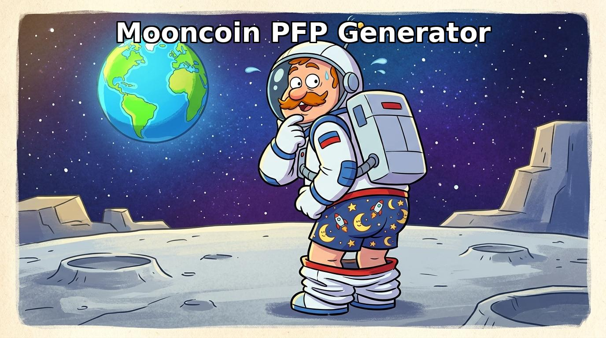

# 🌕 Mooncoin PFP Generator 🚀🍑

Welcome to the **Mooncoin PFP Generator** — the most highly-engineered, unnecessarily advanced profile picture bot in the crypto space. 

Did you want a boring, normal astronaut PFP? Too bad. This bot takes your Telegram profile picture, slaps it inside a massive space helmet, and then photobombs you with a rogue astronaut mooning the camera in the background. 

It is the ultimate way to show the timeline that you are ready for launch. 🚀

## ✨ Features
* 🤖 **Zero-Click Magic**: Type `/start`, click the button, and the bot instantly steals your current Telegram PFP and teleports you to the moon.
* 🎲 **Gacha-Style Randomizer**: Every time you click, you get one of **16 unique variations**. Will you be a Cyberpunk astronaut? A deep-sea diver? A solid gold king? A zombie? You have to click to find out.
* 🎯 **Computer Vision Tech**: We built a custom Python script (`auto_processor.py`) that uses computer vision flood-fill algorithms to mathematically slice a pixel-perfect hole into the neon green helmet visors. Yes, we used military-grade object recognition just to make a meme bot.
* 💬 **Group Chat Chaos**: Add the bot to your Telegram group! Anyone can type `/moon` to summon the generator and show off their cheeks to the chat.

## 🛠️ How to Run Your Own
1. Clone the repo.
2. Install the boring stuff: `npm install`
3. Create a `.env` file in the root directory and add your bot token:
   `TELEGRAM_TOKEN=your_botfather_token_here`
4. Fire the rockets: `npx pm2 start index.js --name mooncoin-pfp-bot`

## 🎨 Adding New Suits
Want to add more suits? Easy.
1. Generate a square image where the helmet visor is **SOLID NEON GREEN** (RGB 0, 255, 0).
2. Save it as `selfie_yoursuit.jpg` in the `/variants/` folder.
3. Run `python3 auto_processor.py variants/selfie_yoursuit.jpg`. The script will automatically scan the image, cut a flawless transparent hole, and generate the JSON coordinates for the bot!

---
*Disclaimer: Mooncoin is not responsible for any HR violations caused by you setting your company Slack profile picture to a mooning astronaut.*
